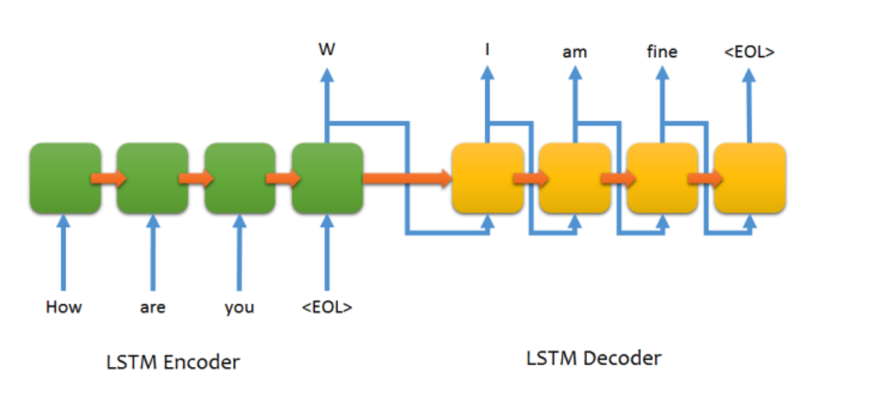

# Sequence to Sequence Natural Language Processing Model in Tensorflow
_by Mustafa Waheed_  

_based on paper_ : http://suriyadeepan.github.io/2016-12-31-practical-seq2seq/

#### This is an end-to-end generative model (closed domain) trained on movie dialouge data.  

[Data Source Link](https://www.cs.cornell.edu/~cristian/Cornell_Movie-Dialogs_Corpus.html)

Conversation Examples
===========
>>Do you remember me?  
Not really .  

>> where are you?  
I ' m here .  

Required Packages  
============
_pytho3.5_  
_numpy_  
_scipy_  
_six_  
_tensorflow version 0.12_  

##### install anyother dependencies that you maybe missing

You can find more info on the version of tensorflow here:  
(https://www.tensorflow.org/versions/r0.12/get_started/os_setup.html)

How to run code
===========
To train this NLP Model, edit the `seq2seq.ini` file so that mode is set to the following  
(based on Sirajology Youtube Video)

`mode = train`  

Then run code from terminal:  
 
``python execute.py``

For testing after the chatbot has fininshed training change option in  `seq2seq.ini` to `mode = test`  

Again, excute main file from terminal  

``python execute.py``

Credits
===========
Credit for essential functions in the code here goes to [suriyadeepan](https://github.com/suriyadeepan).  
I primarily implement a bug free wrapper over it.. 
